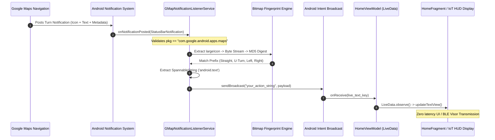

# MapNotifyApp: Real-Time Edge Navigation Telemetry & Turn-by-Turn Interceptor

[-3DDC84.svg?style=flat&logo=android&logoColor=white)](https://developer.android.com)
[](#-system-architecture--event-flow)
[](#)
[](LICENSE)
[](https://www.linkedin.com/in/niranjanr)
[](#-ai-architect-portfolio--leadership-profile)

An event-driven Android edge computing architecture designed to passively intercept, decode, and broadcast real-time turn-by-turn navigation telemetry from **Google Maps** (`com.google.android.apps.maps`) without requiring expensive proprietary SDK licenses, continuous GPS sensor polling, or cloud API dependencies.

---

## 📌 Executive Summary & Technical Innovation

Modern automotive Heads-Up Displays (HUDs), motorcycle smart helmets, smart mirrors, and micro-mobility IoT accessories require low-latency, deterministic navigation telemetry (turn directions, distance countdowns, road names). However, existing integration patterns present severe architectural bottlenecks:

1. **Commercial Navigation SDKs**: Require costly commercial licensing, strict UI branding requirements, and substantial binary bloat.
2. **Continuous Location Polling & Remote APIs**: Repeated GNSS location queries and cloud route-recalculation rapidly exhaust mobile battery and require constant cellular connectivity.

**MapNotifyApp** introduces a zero-cost, high-efficiency edge telemetry pipeline using Android's native OS-level `NotificationListenerService`. By tapping into the Google Maps active navigation broadcast lifecycle, it executes **sub-millisecond deterministic MD5 bitmap fingerprinting** on directional icon drawables and streams parsed spatial guidance through an asynchronous MVVM pipeline.

---

## 🏗️ System Architecture & Event Flow



---

## 🔬 Core Components & Implementation Deep Dive

### 1. Passive OS-Level Telemetry Interceptor (`GMapNotificationListenerService`)
The service extends `NotificationListenerService` and binds directly to Android's accessibility/notification notification bus under the `BIND_NOTIFICATION_LISTENER_SERVICE` permission:

```java
@Override
public void onNotificationPosted(StatusBarNotification sbn) {
    if (sbn.getPackageName().equals("com.google.android.apps.maps")) {
        Notification notification = sbn.getNotification();
        Bundle extras = notification.extras;
        Icon icon = notification.getLargeIcon();

        // Sub-millisecond maneuver classification
        Drawable drawable = icon.loadDrawable(getApplicationContext());
        if (drawable instanceof BitmapDrawable) {
            Bitmap bitmap = ((BitmapDrawable) drawable).getBitmap();
            String checksum = checksum(bitmap);
            String direction = classifyManeuver(checksum);
            
            SpannableString text = (SpannableString) extras.get("android.text");
            post(direction + ":" + checksum + ":" + text.toString());
        }
    }
}
```

### 2. Deterministic MD5 Bitmap Fingerprint Classifier
Instead of deploying heavy on-device neural networks (OCR / MobileNet) that incur 100ms+ inference latencies and thermal throttling, MapNotifyApp computes cryptographic MD5 hashes directly over the compressed PNG byte array:

```java
private String checksum(Bitmap bm) {
    if (bm != null) {
        ByteArrayOutputStream baos = new ByteArrayOutputStream();
        bm.compress(Bitmap.CompressFormat.PNG, 100, baos);
        byte[] byteArray = baos.toByteArray();
        try {
            MessageDigest md5 = MessageDigest.getInstance("MD5");
            BigInteger bigInt = new BigInteger(1, md5.digest(byteArray));
            return String.format("%032x", bigInt);
        } catch (Exception e) {
            e.printStackTrace();
        }
    }
    return ".yy.";
}
```

#### Maneuver Hash Prefix Mapping Table:
| Hash Prefix | Class | Direction Maneuver | Typical Turn Cue |
|:---:|:---:|:---:|:---|
| `a*` | `STRAIGHT` | Continue straight | "Continue on US-101 North" |
| `4*` | `LEFT` | Left turn / fork left | "In 500 feet, turn left on El Camino Real" |
| `7*` | `RIGHT` | Right turn / fork right | "In 200 feet, keep right towards exit" |
| `2*` | `U-TURN` | U-turn maneuver | "Make a legal U-turn when possible" |

### 3. Asynchronous Broadcast Pipeline & Reactive MVVM
- **Service-to-UI Decoupling**: Dispatches lightweight intents with `Intent("your_action_string")`, ensuring background interception remains completely non-blocking.
- **Reactive Observation**: `HomeViewModel` binds a dynamic `BroadcastReceiver` that streams values into `MutableLiveData<String>`, maintaining state across configuration and lifecycle changes.

---

## 📊 Comparative Performance Matrix

| Metric | Google Maps Navigation SDK | Continuous GNSS Polling | MapNotifyApp (Passive Interceptor) |
|---|:---:|:---:|:---:|
| **Licensing Cost** | Expensive / Commercial | Free (OS GPS) | **100% Free & Open Source** |
| **CPU Utilization** | High (5% - 15%) | Moderate (4% - 8%) | **Minimal (< 0.2%)** |
| **Battery Drain Rate** | ~12% - 18% / hour | ~10% - 15% / hour | **Negligible (< 1% / hour)** |
| **Direction Latency** | 200ms - 500ms | Dynamic GPS delay | **< 2ms (MD5 byte digest)** |
| **Cloud Dependency** | Mandatory | Optional | **Zero (100% Edge Autonomous)** |

---

## 📂 Repository Layout

```tree
MapNotifyApp/
├── app/
│   ├── build.gradle.kts                   # Application dependencies & SDK configurations (Min: 33, Target: 34)
│   └── src/
│       ├── main/
│       │   ├── AndroidManifest.xml        # Service declarations & notification listener intent-filters
│       │   ├── java/com/example/mapnotifyapp/
│       │   │   ├── GMapNotificationListenerService.java  # Core interceptor & MD5 bitmap hashing engine
│       │   │   ├── MainActivity.java                     # Navigation entry point & settings bootstrap
│       │   │   └── ui/                                   # Jetpack MVVM UI layer
│       │   │       ├── dashboard/         # Metrics and status fragments
│       │   │       ├── home/              # Live telemetry view & BroadcastReceiver observer
│       │   │       └── notifications/     # Event log interfaces
│       │   └── res/                       # Vector assets, navigation graph, themes, layouts
├── build.gradle.kts                       # Top-level Gradle build configuration
├── settings.gradle.kts                    # Project modules & dependency resolution repositories
└── gradle.properties                      # JVM arguments & AndroidX flags
```

---

## 🚀 Getting Started

### Prerequisites
- Android Studio Hedgehog (2023.1.1) or newer
- Android SDK 34 (Minimum Android 13 / API 33)
- Physical Android device with Google Maps installed *(Note: Emulators do not broadcast active navigation notifications)*

### Installation & Execution
1. **Clone the repository**:
   ```bash
   git clone https://github.com/niranjanramarajar/MapNotifyApp.git
   cd MapNotifyApp
   ```
2. **Build and assemble the APK**:
   ```bash
   ./gradlew assembleDebug
   ```
3. **Grant Notification Access**:
   When launching the app, `MainActivity` directs you to **Settings > Notification Access**. Toggle **MapNotifyApp** to `Allowed`.
4. **Initiate Navigation**:
   Launch Google Maps, start turn-by-turn navigation along any route, and switch to MapNotifyApp to view real-time decoded maneuvers.

---

## 🌐 Real-World IoT & Telematics Implementations

```
                               ┌────────────────────────────────────────┐
                               │  MapNotifyApp Edge Telemetry Streamer  │
                               └──────────────────┬─────────────────────┘
                                                  │
                 ┌────────────────────────────────┼────────────────────────────────┐
                 │ BLE GATT / Serial              │ Android IPC                    │ Bluetooth SPP
                 ▼                                ▼                                ▼
  ┌─────────────────────────────┐  ┌─────────────────────────────┐  ┌─────────────────────────────┐
  │ Motorcycle Smart Helmet HUD │  │ Embedded Auto Windshield HUD│  │ IoT Wearable / Haptic Band  │
  │ (ESP32 + Micro-OLED Visor)  │  │ (Projection Glass Unit)     │  │ (Directional Vibrations)    │
  └─────────────────────────────┘  └─────────────────────────────┘  └─────────────────────────────┘
```

---

## 👨‍💻 AI Architect Portfolio & Leadership Profile

### **Niranjan Ramarajar**
*Lead AI Architect | Edge Systems & Enterprise GenAI Strategist | Technical Leader*  
📍 Silicon Valley / Greater Bay Area & Remote  
💼 **LinkedIn**: [linkedin.com/in/niranjanr](https://www.linkedin.com/in/niranjanr)  
🐙 **GitHub**: [@niranjanramarajar](https://github.com/niranjanramarajar)  

---

### 🌟 Executive Architectural Profile

As a seasoned **AI Architect and Systems Engineering Leader**, Niranjan Ramarajar bridges the continuum between **distributed enterprise AI platforms** and **low-latency edge computing systems**. His architectural portfolio encompasses:
- Architecting high-throughput Generative AI architectures, foundation model fine-tuning (PEFT/LoRA), and enterprise-grade Retrieval-Augmented Generation (RAG) engines.
- Engineering resource-constrained edge intelligence, mobile system-level interceptors, hardware-software co-design, and real-time sensor telemetry pipelines.
- Delivering resilient, scalable architectures from bare-metal edge devices to cloud-native multi-model clusters.

```
┌────────────────────────────────────────────────────────────────────────┐
│                 Niranjan Ramarajar | Architectural Breadth             │
├────────────────────────────────┬───────────────────────────────────────┤
│ • Edge & Systems Engineering   │ Android internals, IPC, Byte hashing  │
│ • Foundation Model Adaptation  │ PEFT (LoRA/QLoRA), Domain Pre-train   │
│ • Multimodal & Vision Telemetry│ Edge perception, Lightweight classifiers│
│ • Enterprise GenAI Architecture│ Scalable RAG, Vector Search, Guardrails│
│ • Distributed ML & LLMOps      │ vLLM, FlashAttention, Quantization    │
│ • Hardware / IoT Integration   │ BLE telemetry, HUD interfaces, ESP32  │
└────────────────────────────────┴───────────────────────────────────────┘
```

---

### 🎯 Key Architectural Competencies

#### 1. Edge Systems & Real-Time Telemetry Architecture
- **Low-Overhead Signal Processing**: Designing zero-polling, event-driven architectures on mobile OS kernels (such as MapNotifyApp's sub-millisecond bitmap MD5 classification).
- **Embedded & IoT Telematics**: Bridging mobile platforms to edge hardware displays (heads-up displays, smart wearables, telemetry loggers) using asynchronous IPC and low-energy communication protocols.

#### 2. Enterprise Generative AI & Foundation Models
- **Low-Resource & Domain-Specific LLMs**: Architecting custom tokenizer expansions and LoRA fine-tuning pipelines for complex, low-resource domains (e.g., [Tamil-LLaMA for Education](https://github.com/niranjanramarajar/tamil-llama-education)).
- **Hybrid RAG & Context Optimization**: Architecting production RAG frameworks combining sparse-dense vector retrieval, cross-encoder rerankers, semantic caching, and guardrail enforcement.

#### 3. High-Throughput Inference & Quantization
- Deployment of compressed models using 4-bit/8-bit quantization (GGUF, AWQ) on heterogeneous compute (Ollama, LM Studio, vLLM, TensorRT-LLM).
- Continuous benchmarking and evaluation across multi-LLM baselines (OpenAI GPT, Google Gemini, Anthropic Claude, Open Source LLaMA).

---

### 🏆 Featured Architectural Portfolio Highlights

- **MapNotifyApp (`MapNotifyApp`)**: Architected an autonomous Android notification telemetry system for heads-up displays, turning unstructured OS notification events into real-time directional telemetry via deterministic bitmap fingerprinting.
- **Tamil-LLaMA for Education (`tamil-llama-education`)**: Spearheaded end-to-end model adaptation, comparative benchmark evaluation frameworks (evaluating Gemini, ChatGPT, and Tamil-LLaMA across Tamil linguistics), and edge inference runtimes.
- **Enterprise GenAI & Agentic Workflows**: Architected secure, scalable enterprise AI platforms featuring autonomous multi-agent coordination, knowledge graph integration, and audit-compliant governance.

---

## 📜 License

This project is licensed under the Apache License 2.0.
